<h1 align="center">Hey, I'm Junaid 👋</h1>

  

  
  
  

---

## 👤 About me

I'm a B.Tech student who enjoys turning ideas into working prototypes and figuring out how things work along the way. I take part in hackathons, build side projects, and learn mostly by making things.

---

## 🚀 What I'm building

| Project | What it is |
| :-- | :-- |
| 🎮 [**GameSet**](https://junaid01125.github.io/gameset/) | A sports platform for tournaments and 1v1 challenge matches. |
| 🇮🇳 [**JanSetu AI**](https://jansetu-report.vercel.app/) | A platform where citizens report local issues and get them routed to the right government department. |

---

## 🎲 Fun stuff

- ⚽ My profile is a football card, and the stats on it are rated by me, so go easy on me.
- 🏆 I'd rather build something small that works than plan something big that doesn't.
- 🧩 I like projects where sports, ideas and real-life problems meet.
- 🤝 Open to hackathon teammates, project ideas and good conversations. Say hi on LinkedIn (button at the top).

<!--
Add your own fun facts here, for example:
- 🍕 Favourite food:
- ⚽ Favourite club / player:
- 🎧 Currently listening to:
-->

---

## 📊 GitHub stats

  
  

  

---

## 🐍 Contribution snake

  

Generated by a GitHub Action in this repo. It appears after the first run (see the repo's SETUP.md).

---

  

